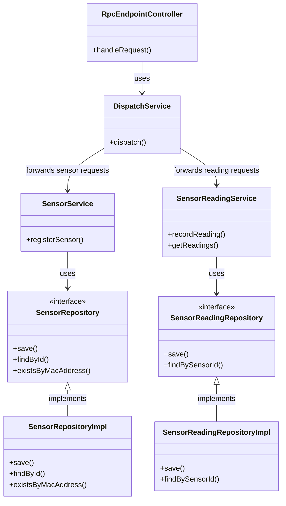
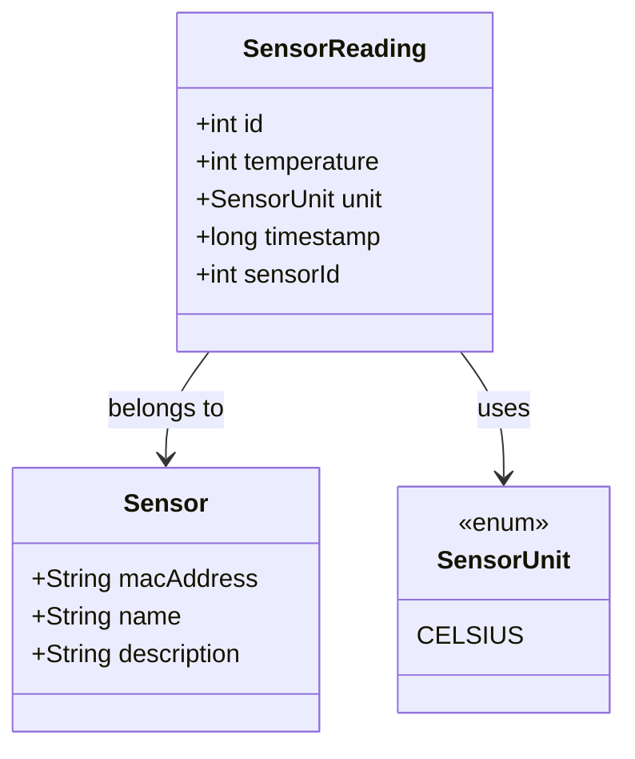

# RoDos - Sensor Data Management System

## Project Overview

RoDos is a Spring Boot application designed for managing sensor data collection, storage, and retrieval. 
The system provides a JsonRPC API for registering sensors and recording temperature readings with timestamp tracking. 
Built with a clean layered architecture.

## Architecture

RoDos follows a **layered architecture** pattern with clear separation of concerns:

- **Presentation Layer**: JSON-RPC API endpoints for sensor operations
- **Application Layer**: Business logic and use cases
- **Domain Layer**: Core entities and relationships
- **Infrastructure Layer**: Database access and external integrations

### Request Flow

1. **API Request** → JSON-RPC Controller (RpcEndpointController)
2. **Routing** → DispatchService (JSON-RPC dispatcher)
3. **Business Logic** → Service layer (SensorService, SensorReadingService)
4. **Data Access** → Repository layer (JDBC-based repositories)
5. **Database** → PostgreSQL (production) / H2 (development/testing)

### Module Map

| Package | Responsibility |
|---------|---------------|
| `eu.wodrobina.rodos` | Main application entry point |
| `eu.wodrobina.rodos.rpc` | JSON-RPC API endpoints and request handling |
| `eu.wodrobina.rodos.sensor` | Sensor management (CRUD, validation) |
| `eu.wodrobina.rodos.sensorreading` | Temperature readings (storage, retrieval) |
| `eu.wodrobina.rodos.sensorreading.api` | DTOs for reading operations |
| `eu.wodrobina.rodos.sensor.api` | DTOs for sensor operations |

## Class Dependencies

### Core Architecture Diagram



### Domain Model



## Tech Stack

### Language & Runtime
- **Java 21** (LTS version)
- **Spring Boot 4.0.2** (modular web framework)

### Core Frameworks

| Framework | Purpose                                   |
|-----------|-------------------------------------------|
| Spring Boot | Application container, auto-configuration |
| Spring Web | Json RPC                                  |
| Spring Data JDBC | Database access layer                     |
| Flyway | Database migrations                       |
| H2 Database | In-memory database for testing            |

### Development Tools
- **Gradle** (build automation)
- **JUnit 5** (testing framework)
- **AssertJ** (assertions)
- **MockMvc** (controller testing)

### Key Engineering Decisions
- **Dependency Injection**: Spring's IoC container
- **JSON-RPC**: Offers clean and simple solution 
- **MVC pattern**: Clean separation between service and database logic
- **DTO Pattern**: Separation of domain models from API responses

## Getting Started

### Prerequisites

- Java 21 JDK
- Gradle 8.5 or higher
- Docker (optional, for production)
- PostgreSQL 15+ (recommended for production)

### Installation

1. **Clone the repository**
```bash
git clone https://github.com/wodrobina/rodos.git
cd rodos
```

2. **Build the project**
```bash
./gradlew build
```

3. **Run tests**
```bash
./gradlew test
```

### Running Locally

#### Option 1: Development mode (H2 database)
```bash
./gradlew bootRun
```

The application will start on `http://localhost:8080`

#### Option 2: Production mode (PostgreSQL)

1. Set up PostgreSQL database
2. Create `.env` file with:
```properties
SPRING_DATASOURCE_URL=jdbc:postgresql://localhost:5432/rodos
SPRING_DATASOURCE_USERNAME=rodos
SPRING_DATASOURCE_PASSWORD=yourpassword
SPRING_DATASOURCE_DRIVER-class-name=org.postgresql.Driver
```

3. Run the application:
```bash
./gradlew bootRun
```

### Configuration

The application uses `application.properties` for configuration:
- Database connection settings
- Server port
- JSON-RPC settings
- Flyway migration settings

## API Endpoints

RoDos provides JSON-RPC API endpoints at `/api/rpc`:

| Method | Endpoint | Description |
|--------|----------|-------------|
| POST | `/api/rpc` | JSON-RPC request handler |

### Available JSON-RPC Methods

- `register_sensor`: Register a new sensor
- `record_reading`: log sensor reading
- `get_readings`: Retrieve all sensor readings


## Testing

### Test Structure

- **Unit Tests**: Testing individual methods (e.g., repository queries)
- **Integration Tests**: Testing API endpoints with MockMvc
- **Database Tests**: Testing with H2 embedded database

### Running Tests

```bash
# Run all tests
./gradlew test

# Run specific test class
./gradlew test --tests SensorRepositoryImplTest

# Run tests with coverage
./gradlew test jacocoTestReport

# Generates report in: build/reports/jacoco/test/html/index.html
```

### Test Utilities

- `TestUtils.java`: Helper methods for test data generation
- `TruncateTablesExtension.java`: Database cleanup between tests

## Docker Deployment

### Build Docker Image

```bash
# Build locally
docker build -t rodos:1.0 .

# Or use the provided Dockerfile

# Build using Gradle (if Docker plugin configured)
./gradlew bootBuildImage
```

### Run with Docker Compose

```bash
# Start PostgreSQL and RoDos
docker-compose up -d

# Application will be available at http://localhost:8080
```

## Notes / Limitations

### Known Constraints

1. **No Authentication**: Current implementation has no authentication/authorization
2. **Single Database**: Currently only supports one database instance
3. **Temperature Range**: No validation for scientifically impossible temperature values
4. **Pagination**: No pagination for readings retrieval (could impact performance with many readings)

### Design Trade-offs

- **JDBC over JPA**: Chosen for explicit control and performance without "magic" , but requires more boilerplate 
- **JSON-RPC over REST**: Provides method-based API but less standard than REST
- **H2 for Tests**: Fast test execution but slightly different behavior than PostgreSQL

## Roadmap

Future enhancements could include:
- Pagination for readings API
- Signed readings 

## AI Usage Disclosure

AI tools were used to assist with generating boilerplate code. All generated code was reviewed and verified by a human. 
The final architecture and implementation decisions are the work of the project's author(s).
